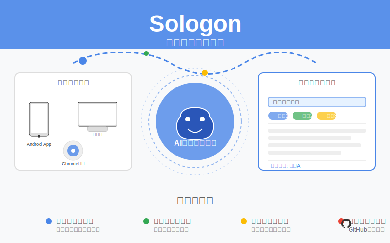

# Sologon - 智能知识入库助手



Sologon 是一款智能知识入库助手，帮助用户以极低的成本记录、管理和同步笔记、灵感、任务等碎片信息。

## 功能特点

- 多端快速记录（Chrome插件、Android App、网页端）
- 四大记录入口（我干了、我想到了、提醒我、做记录）
- 智能内容结构化（自动标题、分类、标签）
- 项目化管理系统
- GitHub 自动同步

## 技术栈

- 前端：React + TypeScript
- 后端：Python + FastAPI
- 数据库：SQLite
- 部署：Docker

## 开发环境设置

### 后端设置

1. 创建虚拟环境：
```bash
cd backend
python3 -m venv venv
source venv/bin/activate
```

2. 安装依赖：
```bash
pip install -r requirements.txt
```

3. 运行后端服务：
```bash
uvicorn app.main:app --reload
```

### 前端设置

1. 安装依赖：
```bash
cd frontend
npm install
```

2. 运行开发服务器：
```bash
npm start
```

## API 文档

启动后端服务后，访问 http://localhost:8000/docs 查看完整的 API 文档。

## 项目结构

```
sologon/
├── backend/
│   ├── app/
│   │   ├── api/
│   │   ├── core/
│   │   ├── db/
│   │   ├── models/
│   │   ├── schemas/
│   │   └── services/
│   └── requirements.txt
├── frontend/
│   ├── public/
│   ├── src/
│   └── package.json
└── README.md
```

## 贡献指南

1. Fork 项目
2. 创建特性分支 (`git checkout -b feature/AmazingFeature`)
3. 提交更改 (`git commit -m 'Add some AmazingFeature'`)
4. 推送到分支 (`git push origin feature/AmazingFeature`)
5. 开启 Pull Request

## 许可证

MIT License 